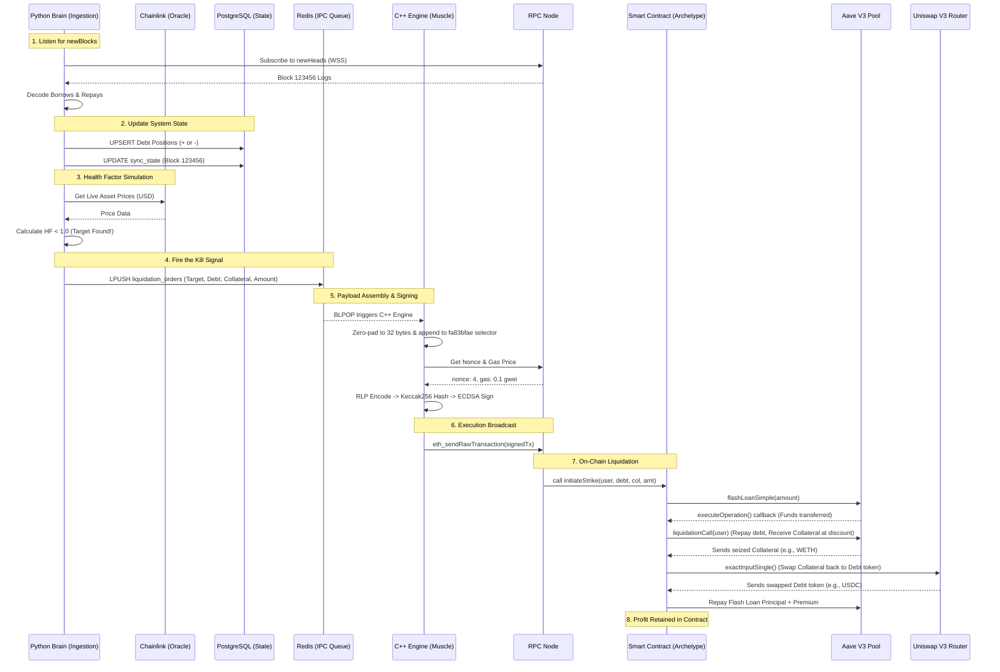

# Archetype Flash Loan System: Functional Requirements & Workflow

This document covers the functional requirements, detailing exactly what the system does, followed by a step-by-step execution flowchart visualizing the architecture.

## Functional Requirements

### 1. Blockchain State Ingestion (The Brain)
- The system must connect to the Arbitrum Layer 2 network via WebSockets.
- It must listen continuously for new blocks (`newHeads`).
- For every new block, it must fetch all logs and filter them for Aave V3 `Borrow` and `Repay` events.
- It must decode the raw hexadecimal logs into standard JSON/Dictionary objects representing the User, Asset, and Amount.

### 2. State Maintenance (The Database)
- The system must insert new users into a PostgreSQL `lending_positions` database.
- It must increase debt amounts when `Borrow` events occur.
- It must decrease debt amounts when `Repay` events occur.
- It must save its current sync state to resume sequentially without missing blocks.

### 3. Oracle Price Simulation
- The system must connect to Chainlink Price Feeds.
- It must fetch the real-time USD prices of Debt and Collateral assets to calculate a user's Health Factor.
- If a target's Health Factor drops below `1.0`, it must trigger the execution pipeline.

### 4. Inter-Process Communication (IPC)
- The Python Brain must format the attack parameters (Target User, Debt Asset, Collateral Asset, Debt Amount).
- It must push this JSON payload instantly to a Redis List (`liquidation_orders`) via `LPUSH`.

### 5. Transaction Crafting (The Engine)
- The C++ Engine must block on the Redis List via `BLPOP` to catch the target payload in zero time.
- It must dynamically pad variable-length addresses and amounts to standard 32-byte EVM words.
- It must append these padded arguments directly behind the execution function selector `fa83bfae`.
- It must RLP-encode the transaction data, hash it via Keccak256, and sign it with ECDSA (secp256k1).
- It must broadcast the raw transaction to the RPC node.

### 6. On-Chain Execution (The Smart Contract)
- The Smart Contract must initiate a Flash Loan from Aave V3 for the specified debt amount.
- In the callback, it must approve Aave to use the flash loaned funds.
- It must trigger `liquidationCall` on Aave, receiving the seized collateral token (e.g., WETH) at a discount.
- It must approve the Uniswap V3 Router to swap the seized collateral.
- It must swap the collateral back to the original debt asset (e.g., USDC), enforcing an `amountOutMinimum` to cover the flash loan debt plus the premium fee.
- It must retain the remaining arbitrage profit securely within the contract.

---

## Step-by-Step System Workflow

